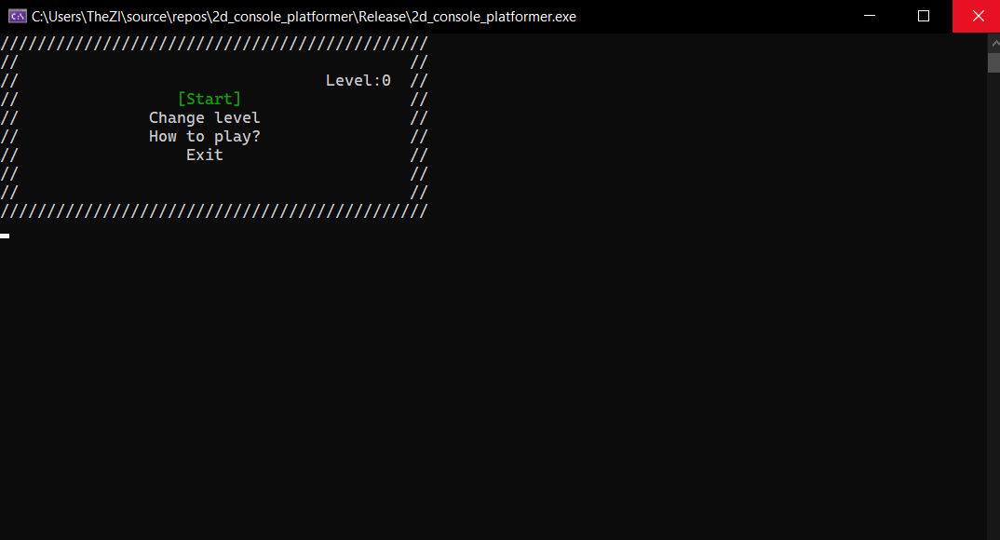
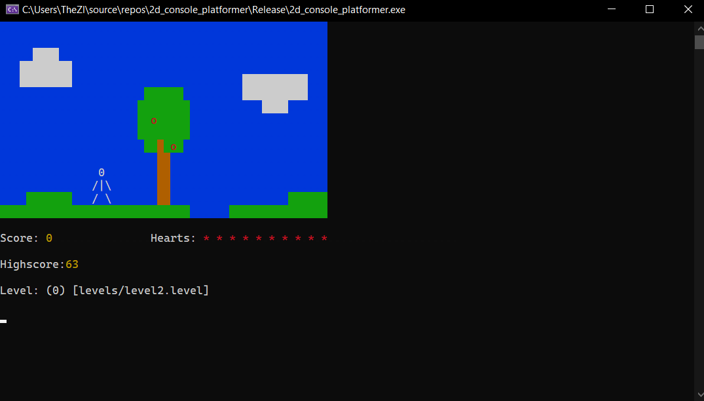

# 2dcg
### I made this game as a project for my first semester programming classes.
### To play the game you need to clone this repo and simply run the .exe file. Keep in mind that you need to store the assets folder in the same directory as your .exe file
#### This project is not cross platform (works only on Windows) - I used Windows.h library so I could use faster console output (for updating the screen).

## Creating maps (or levels) is fairly easy - I'll walk you through an example:
- Create .level file (example level file showed below)
```c++
4
maps/map1.1.map
maps/map1.2.map
maps/map1.3.map
maps/map1.4.map
6 [03,2] [\4,3] [/2,3] [|3,3] [/2,4] [\4,4] 10 4
11
```
-- first line is how many maps there is in level
-- next four lines are the relative links to map
-- the next one is kinda tricky - first type in a number that indicates player pixels, than give his position (relatively to any point in the map; I used top left corner). Then, next values are HP and jump height
-- last line is for saving high score
- Create .map files that you included in .level file (example shown below)
```c++
3 3
. . .
. . .
. . .
```
-- of course this map wouldn't work in this example (becaue it's too small)
-- each pixel in the map can have options or colors assigned to it (they are listed in map.cpp file when creating map; example below)
```c++
.f1/b1/c
```
-- it means that the pixel has farbe (color) 1, background 1 and is collidable.
## Screenshots of the game:


